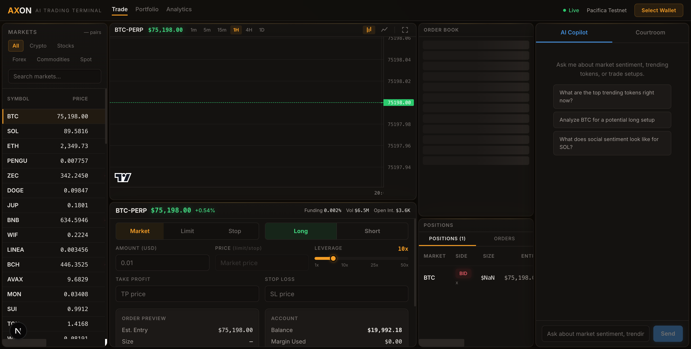
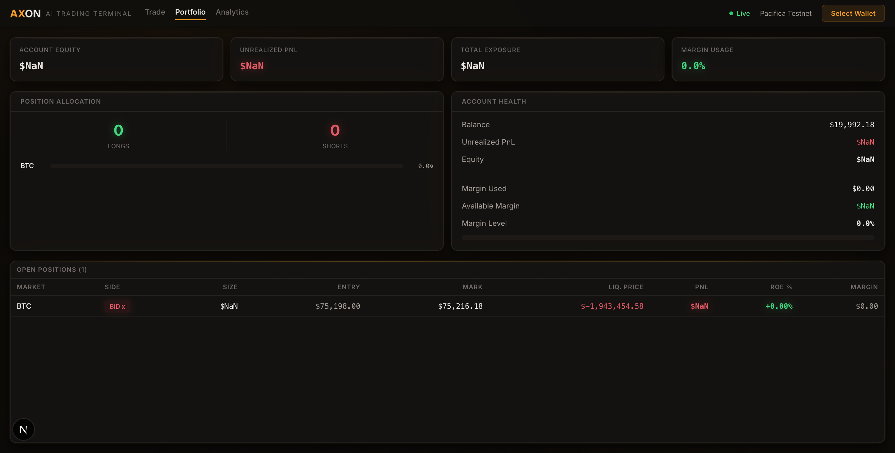
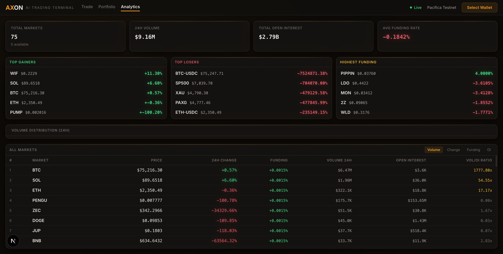

# AXON: AI-Powered Perpetuals Trading Terminal

A trading terminal for Pacifica's perpetual futures exchange with 75 live markets, an AI copilot powered by Elfa AI social intelligence, and a Liquidation Courtroom that detects whether market moves are organic or manufactured.

[](https://www.typescriptlang.org/)
[](https://nextjs.org/)
[](https://react.dev/)
[](https://solana.com/)
[](LICENSE)



---

## What Is AXON?

Perpetual futures are the most traded instruments in crypto, but the tools traders use are basic: a chart, an order form, and nothing else. Traders have no way to tell whether a move against their position is a genuine correction or coordinated manipulation.

AXON connects to Pacifica's REST API (9 endpoints) and WebSocket feed to provide full trading across 75 markets. It adds two layers no other terminal has: an AI copilot that combines Pacifica market data with Elfa AI social intelligence, and a Liquidation Courtroom where an AI judge evaluates whether price moves against your position are organic or manufactured.

---

## Demo Video

[YouTube link]

---

## Screenshots

| Trading Terminal | Portfolio Dashboard |
|:---:|:---:|
|  |  |

| Analytics | AI Copilot |
|:---:|:---:|
|  |  |

---

## Features

### Trading
- **75 Live Markets**: Crypto, stocks, forex, commodities, and spot pairs streaming via Pacifica WebSocket
- **Market, Limit, and Stop Orders**: Full order types with live preview showing entry price, position size, liquidation price, and fees before you commit
- **Configurable Leverage**: Per-market leverage up to the market maximum (typically 50x, API supports up to 200x)
- **Take Profit / Stop Loss**: Set TP/SL on any open position after entry
- **Live Order Book**: Real-time bid/ask depth with visual bars and spread calculation
- **TradingView Charts**: Candlestick and line charts across 6 timeframes (1m, 5m, 15m, 1H, 4H, 1D)

### AI Intelligence
- **AI Copilot**: Ask about any market and get analysis combining Pacifica data (price, volume, funding rates) with Elfa AI social data (trending tokens, mention counts, sentiment scores). Returns structured trade suggestions with entry, take profit, stop loss, and confidence score. One click applies the suggestion to the order form.
- **Trending Tokens**: Live feed of tokens generating the most social buzz right now, powered by Elfa AI. Click any token to get the copilot's analysis.
- **Liquidation Courtroom**: Send any open position to the AI judge. It runs a full hearing across three independent dimensions: Market Pressure (price action + funding rates from Pacifica), Social Intelligence (mention volume + sentiment from Elfa AI), and Risk Assessment (leverage, margin, liquidation distance). If there is a large price move with no social activity to support it, the judge flags potential manipulation. Returns a trust score and a recommendation: hold, hedge, or exit.

### Portfolio and Analytics
- **Portfolio Dashboard**: Account equity, unrealized PnL, total exposure, margin usage, position allocation (long vs short), margin health indicator, and a full positions table with ROE% per position
- **Analytics View**: Market overview stats (total volume, open interest, average funding), top gainers, top losers, highest funding rates, volume distribution chart, and a sortable table of all 75 markets

---

## Tech Stack

| Layer | Technology |
|-------|-----------|
| Frontend | Next.js 16.2.3, React 19.2.4, Tailwind v4 |
| Charts | TradingView Lightweight Charts |
| State | TanStack React Query, useSyncExternalStore |
| Real-time | Pacifica WebSocket (prices, orderbook, trades) |
| AI | Claude API (copilot + courtroom), Elfa AI (social intelligence) |
| Wallet | Solana Wallet Adapter (Phantom, Solflare) |
| Signing | tweetnacl Ed25519 + bs58 (server-side) |
| Build | Turbopack, pnpm |

---

## Getting Started

### 1. Set Up a Pacifica Account

1. Go to [test-app.pacifica.fi](https://test-app.pacifica.fi/) and create an account using your Solana wallet (Phantom or Solflare)
2. Request testnet funds from the faucet on the Pacifica app
3. Deposit the faucet funds into your Pacifica trading account

### 2. Run AXON Locally

```bash
git clone https://github.com/dmustapha/axon.git
cd axon
pnpm install
cp .env.example .env.local
```

Fill in `.env.local` with your keys:

```
PACIFICA_PRIVATE_KEY=your_base58_private_key
PACIFICA_PUBLIC_KEY=your_base58_public_key
ANTHROPIC_API_KEY=your_anthropic_api_key
ELFA_API_KEY=your_elfa_api_key
```

The Pacifica private key is the base58 private key from the same wallet you used to create your Pacifica account.

```bash
pnpm dev
# Open http://localhost:3000
```

### 3. Connect Your Wallet

Click "Select Wallet" in the top-right corner and connect the same Phantom or Solflare wallet you used on Pacifica. The WebSocket status indicator (top-right) will show green when live data is streaming.

---

## Using AXON

### Browsing Markets

The left sidebar shows all 75 Pacifica markets. Filter by category (Crypto, Stocks, Forex, Commodities, Spot) or search by name. Markets are sorted by 24h volume. Click any market to load its chart and order book. Prices flash on update.

### Placing a Trade

1. Select **Market**, **Limit**, or **Stop** order type
2. Choose **Long** or **Short**
3. Enter the amount in USD
4. Adjust leverage with the slider (1x to the market maximum)
5. For Limit/Stop orders, enter your target price
6. Review the order preview: entry price, position size in the asset, liquidation price, and estimated fees
7. Click the Long/Short button to submit

After the order fills, optionally set Take Profit and Stop Loss prices on the position.

### Managing Positions

Open positions appear in the bottom panel with real-time mark-to-market PnL. Each position shows: market, side with leverage, size, entry price, current mark price, unrealized PnL, and margin ratio. Positions with margin below 15% are highlighted in red as a liquidation warning.

- **Close**: Sends an opposite-side market order with reduce_only to close the position
- **Analyze**: Sends the position to the Liquidation Courtroom for manipulation analysis

Switch to the Orders tab to view open orders and order history.

### AI Copilot

The right panel has two tabs: AI Copilot and Courtroom.

The copilot answers questions about markets by combining live Pacifica data with Elfa AI social intelligence. Example prompts:
- "What are the top trending tokens right now?"
- "Analyze BTC for a potential long setup"
- "What does social sentiment look like for SOL?"

Trending tokens appear at the top of the copilot panel, showing up to 6 tokens with the most social activity. Click any token to ask the copilot about it.

When the copilot suggests a trade, it includes entry price, take profit, stop loss, and confidence score. Click the suggestion to auto-populate the order form, then review and submit.

### Liquidation Courtroom

Switch to the Courtroom tab to send any open position to the AI judge. The courtroom runs three independent evaluations:

1. **Market Pressure**: Analyzes price action and funding rates from Pacifica
2. **Social Intelligence**: Checks mention volume and sentiment from Elfa AI
3. **Risk Assessment**: Evaluates your leverage, margin, and distance to liquidation

The judge cross-references these scores. A large price move with no supporting social activity is flagged as a potential manipulation signal. The verdict includes a trust score (0-100%) and a recommendation: hold, hedge, or exit.

Positions with margin below 15% are automatically surfaced as "at-risk" for quick analysis.

### Portfolio

Navigate to Portfolio (keyboard shortcut: 2) to see:
- Account equity, unrealized PnL, total exposure, and margin usage
- Position allocation breakdown (long vs short)
- Margin health with a visual indicator (green/gold/red based on usage)
- Full positions table with ROE% and liquidation prices

### Analytics

Navigate to Analytics (keyboard shortcut: 3) to see:
- Market overview: total markets, 24h volume, open interest, average funding
- Top 5 gainers, top 5 losers, and top 5 highest funding rates
- Volume distribution across the top 10 markets
- Sortable full market table (sort by volume, change, funding, or open interest)

---

## Pacifica Integration

AXON uses 9 Pacifica REST API endpoints and the WebSocket feed. Every POST request is signed server-side using Ed25519 (tweetnacl + bs58), the same signing scheme Solana uses.

### REST API Endpoints

| Method | Endpoint | Description |
|--------|----------|-------------|
| GET | `/info` | Market specs for all 75 markets |
| GET | `/account` | Account equity, balance, margin, fee level |
| GET | `/account/positions` | All open positions with PnL |
| GET | `/account/orders` | Open orders and order history |
| POST | `/orders/create_market` | Place market orders |
| POST | `/orders/create` | Place limit and stop orders |
| POST | `/orders/cancel` | Cancel orders by ID or bulk |
| POST | `/account/leverage` | Set per-market leverage (1-200x) |
| POST | `/positions/tpsl` | Configure take profit / stop loss |

### WebSocket Feeds
- Live price streams across all 75 markets
- Order book depth updates (bids and asks)
- Trade stream for chart candle data

### AXON API Routes

| Method | Endpoint | Description |
|--------|----------|-------------|
| GET | `/api/account` | Account balance and info |
| GET | `/api/positions` | Open positions |
| GET | `/api/orders` | Open orders (add `?history=true` for history) |
| GET | `/api/info` | Market specifications |
| POST | `/api/trade` | Place order (market/limit/stop) |
| POST | `/api/orders/cancel` | Cancel order |
| POST | `/api/positions/tpsl` | Set TP/SL |
| POST | `/api/copilot` | AI copilot chat |
| POST | `/api/courtroom` | Liquidation courtroom analysis |
| GET | `/api/elfa` | Elfa AI social intelligence proxy |
| GET | `/api/wallet` | Connected wallet info |

---

## How It Works

```
Browser (Phantom / Solflare)
  |
  v
Next.js Frontend (React 19 + Tailwind v4)
  |
  +---> TradingView Charts (6 timeframes)
  |
  +---> WebSocket <---- Pacifica WS (prices, orderbook, trades)
  |
  v
Next.js API Routes (Ed25519 server-side signing)
  |
  +---> Pacifica REST API (9 endpoints)
  |     [signed with tweetnacl + bs58]
  |
  +---> Claude API (copilot + courtroom)
  |
  +---> Elfa AI (trending tokens, sentiment, mentions)
```

---

## Project Structure

```
src/
  app/
    page.tsx                  # Main trading terminal (4-column grid layout)
    layout.tsx                # Root layout with providers
    providers.tsx             # React Query + WS + Wallet + Price providers
    globals.css               # Dark terminal theme design system
    api/
      account/route.ts        # Account balance/info
      copilot/route.ts        # AI copilot (Claude + Elfa)
      courtroom/route.ts      # Liquidation courtroom AI
      elfa/route.ts           # Elfa social intelligence proxy
      info/route.ts           # Market specifications
      orders/route.ts         # Order list/history
      orders/cancel/route.ts  # Cancel orders
      positions/route.ts      # Open positions
      positions/tpsl/route.ts # Take profit / stop loss
      trade/route.ts          # Place orders (market/limit/stop)
      wallet/route.ts         # Wallet info
  components/
    price-chart.tsx           # TradingView chart (candlestick + line)
    order-panel.tsx           # Order form with preview
    position-display.tsx      # Positions table with close/analyze
    orderbook-display.tsx     # Live order book depth
    chat-panel.tsx            # AI copilot + trending tokens
    courtroom-tab.tsx         # Liquidation courtroom UI
    market-selector.tsx       # Market category filter + search
    price-grid.tsx            # Live price table (75 markets)
    portfolio-view.tsx        # Portfolio dashboard
    analytics-view.tsx        # Market analytics
  hooks/                      # React Query data fetching
  lib/
    signing.ts                # Ed25519 request signing
    pacifica.ts               # Pacifica API client
    constants.ts              # URLs, intervals, categories
    pnl.ts                    # PnL calculation
    format.ts                 # Number formatting
  providers/
    ws-provider.tsx           # WebSocket connection manager
    price-provider.tsx        # Price feed (WS -> React)
    wallet-provider.tsx       # Solana wallet adapter (Phantom, Solflare)
  stores/
    price-store.ts            # Price state (useSyncExternalStore)
  types/
    index.ts                  # TypeScript interfaces
```

---

## License

MIT
